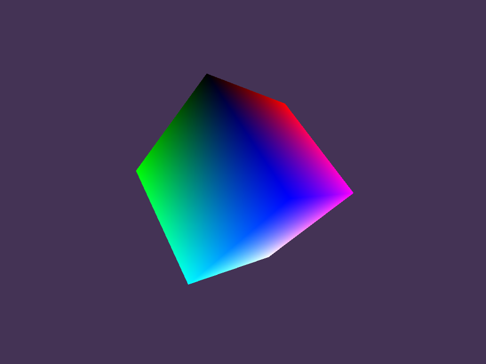
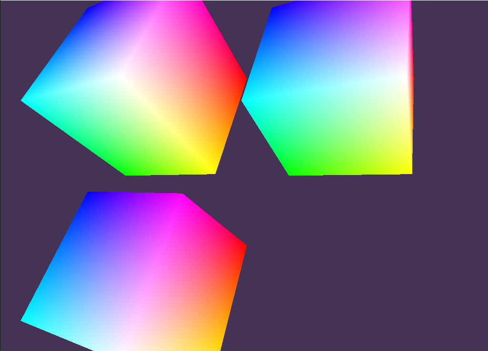

# FlukyEngine

Motor de juegos desarrollado en C++ para el ramo CC5512 - Arquitectura de Motores de Juegos, enfocado en juegos de plataforma 3D que utilizan figuras simples.

## Dependencias

Todas las dependencias del proyecto están en la carpeta `thirdParty/`

- [ImGui](https://github.com/ocornut/imgui) para gui de depuración.
- [GLFW](https://www.glfw.org/) para la creación y manejo de ventanas e input.
- [glad](https://glad.dav1d.de/) para cargar las funciones de OpenGL.
- [glm](https://glm.g-truc.net/0.9.9/index.html) para algebra lineal.
- [dr_wav](https://mackron.github.io/dr_wav.html) para cargar archivos .wav desde disco.
- [OpenAL-Soft](https://github.com/kcat/openal-soft) para la implementación del sistema de audio.
- [BGFX](https://github.com/bkaradzic/bgfx) como librería encargada del renderizado de figuras en 3 dimensiones.
- [Easy3D](https://github.com/LiangliangNan/Easy3D) como segunda librería de renderizado (incluida por posibles errores, no esta siendo utilizada por el momento).
- [EnTT](https://github.com/skypjack/entt) administra las entidades del motor.

## Software/Libreria externas necesarias

Para generar el proyecto, solución o makefiles se necesita [CMake 3.8+](https://cmake.org/), y de OpenGL4.5 para funcionar. Todo fue probado en Windows 10.

## Importando el proyecto

Clonar el repositorio

`git clone ...`

Luego como tiene dependencias de otros repositorios hace falta ejecutar lo siguiente (Ojo! solo será necesario la primera vez)

`git submodule update --init --recursive`

Si los submódulos se actualizan se deberá ejecutar 

`git submodule update --recursive`

Y listo! solo queda generar la `Build` del motor.

(Es posible que si hay errores en el build se deba a que no está Doxygen instalado, descargar instalador desde [aquí](https://www.doxygen.nl/files/doxygen-1.9.2-setup.exe))

## Generando la solución o makefiles y el proceso de compilación

La solución solamente ha sido probada en Windows 10 y directamente de Visual Studio 2019. Y el paso principal es generar el `Build` del `CMakeLists.txt` que se define el proyecto, en este caso el que se encuentra afuera de las carpetas. 

Los ejemplos serán generados automáticamente y serán los siguientes:

- `ex_audio.exe` Para la prueba del audio 3D, el cubo principal emite un sonido. El cuerpo puede ser trasladado en el espacio con el análogo izquierdo del joystick (eje X e Y) y para la profundidad se utiliza el análogo derecho.
- `ex_components.exe` Se inicializan 3 game objects distintos, los cuales se mantienen rotando en la misma posición constantemente.
- `ex_deleteobject.exe` Se inicializa un game object que se puede mover en el espacio y que puede ser eliminado con la tecla A del joystick.
- `ex_multiaudio.exe` Se crean 2 game objects con box component asignadas, los cuales se pueden mover en el espacio con 2 joysticks. Además cada uno emite un sonido distinto que probará la emisión de sonido en simultaneo de distintos cuerpos.
- `ex_players.exe` Se crean 2 game objects con box component asignadas, las cuales se encuentran en un lugar determinado y pueden girar en el lugar con la ayuda de 2 joysticks.

Toda la explicación puede ser vista en el video de la demostración haciendo clic [aquí](https://youtu.be/E3vkcPsZdg8)

## Como crear aplicaciones usando el motor

Para crear juegos es recomendable utilizar los ejemplos descritos en la sección anterior. Principalmente se deben inicializar todos los objetos que serán creados en la escena en `UserStartUp()`. Para empezar es necesario inicializar un game object con `world.CreateGameObject()` y de esta manera se le podrá asignar distintos componentes. Los componentes posibles son:

- `AudioComponent`, permite ejecutar un archivo `.wav`. Además es posible trasladarlo en el espacio.
- `PlayerComponent`, asigna un gamepad al game object. Se debe entregar el JoystickInput (`&world.GetJoystickInput()`) y el índice del player que podrá manipular el game object.
- `BoxComponent`, asigna un cubo que se renderizará en el espacio. Este podrá ser trasladado y rotado según el usuario lo requiera con la ayuda de un `TransformComponent`.
- `TransformComponent`, define las transformaciones (traslación y rotación) que pueden ser reflejadas en el `BoxComponent` asignado al mismo game object. 

Cada uno de los componentes tiene distintas funciones que podrá utilizar el usuario, donde cada una está documentada en los archivos generados por doxygen. 

El usuario tendrá permitido actualizar los valores de cada componente asignado a los game objects creados en un inicio. Esto debe ser realizado en `UserUpdate()`.

(Todo lo explicado anteriormente puede ser entendido mucho más fácil si se miran los ejemplos que se encuentran en la carpeta `examples-fluky`).

## Documentación

Toda la información acerca de las funciones y clases creadas se puede ver mediante [Doxygen](https://www.doxygen.nl/index.html). Para esto se debe tener instalado Doxygen y luego solamente buildear el proyecto. Finalmente la documentación estará en `doc_doxygen/index.html`.

## Screenshots

